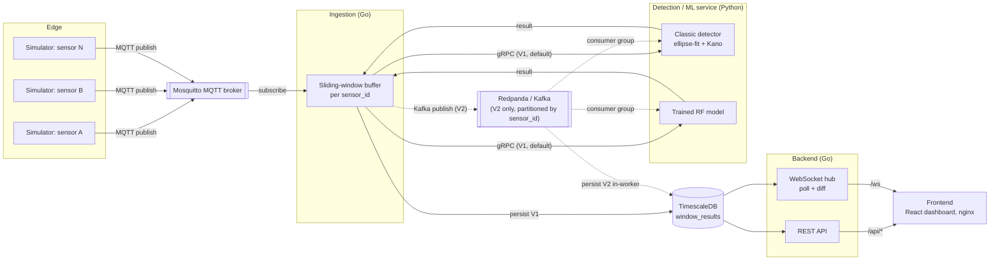
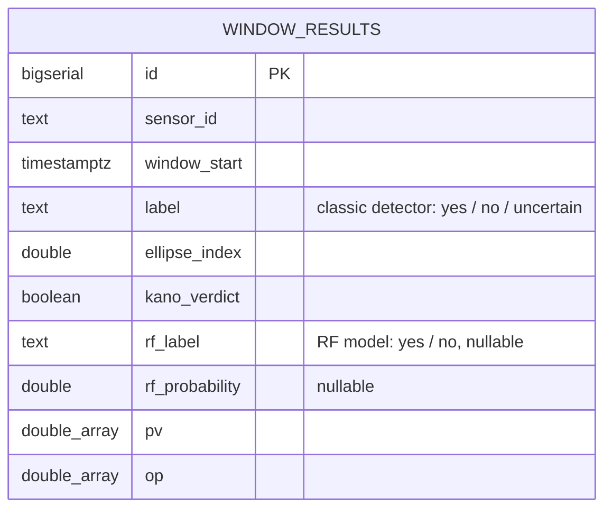
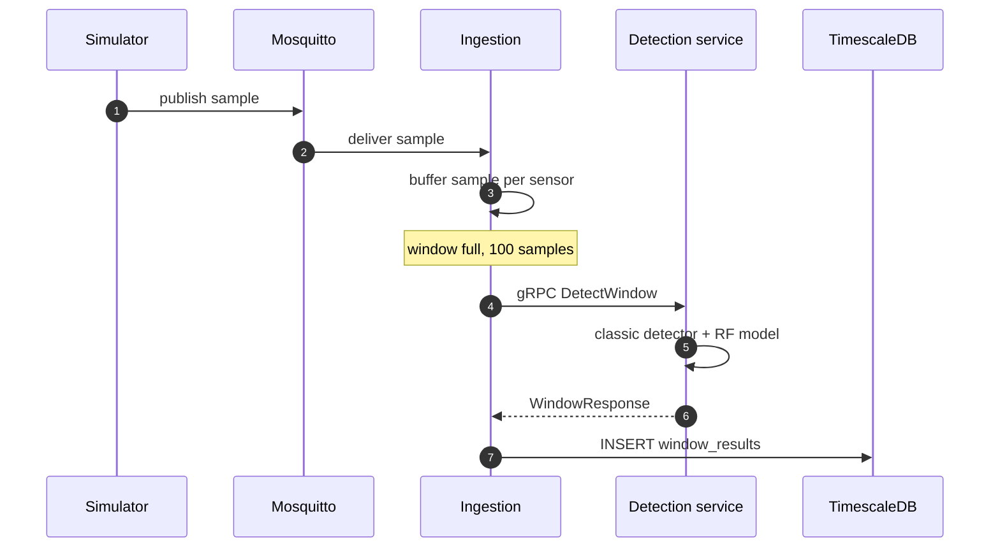
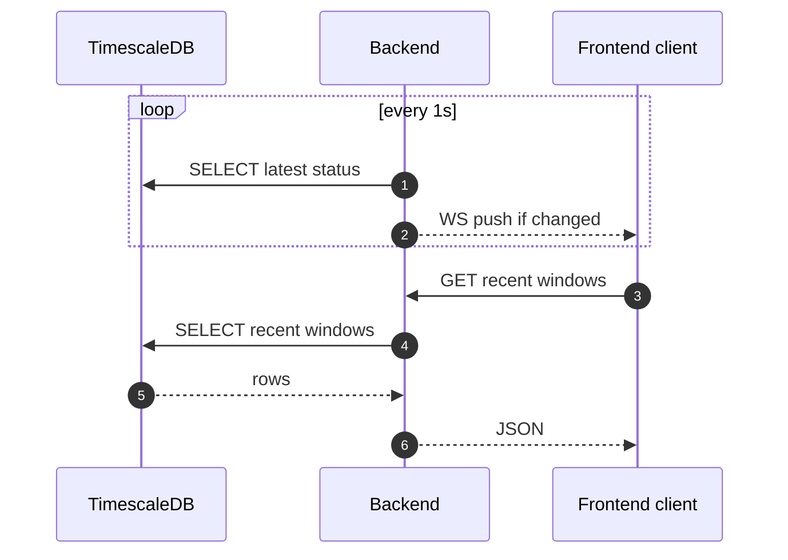
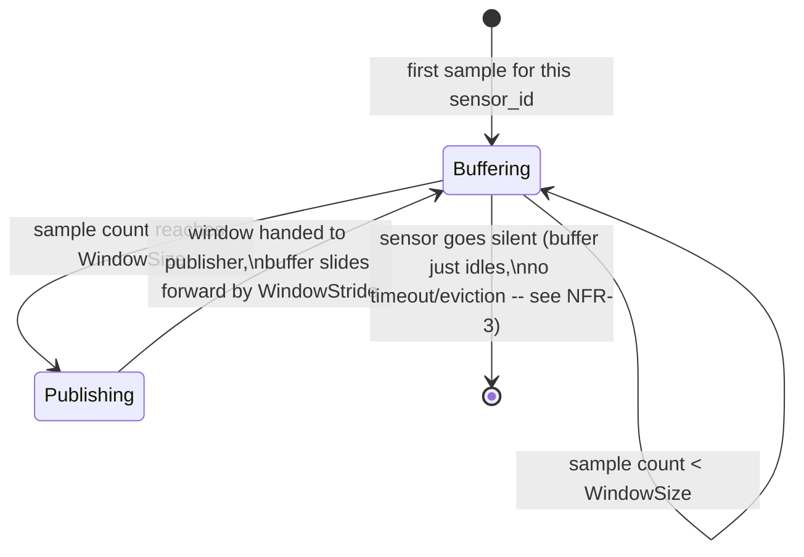
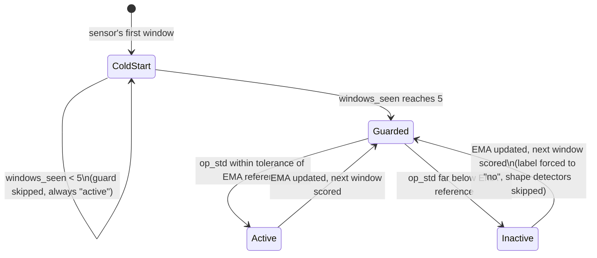
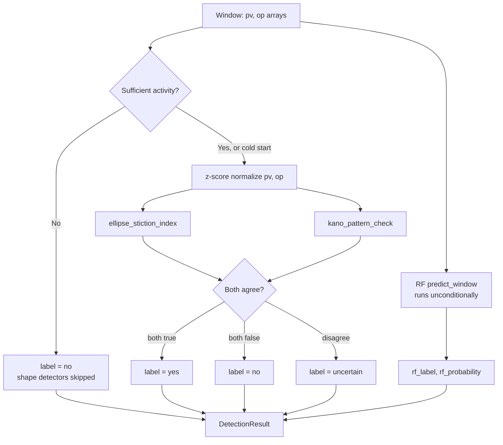

# High-Level Design — Valve Stiction Fault-Detection Pipeline

System-wide design reference across all 5 repos ([simulator](https://github.com/maulanaiskak/valve-stiction-simulator), [ingestion](https://github.com/maulanaiskak/valve-stiction-ingestion), [detection](https://github.com/maulanaiskak/valve-stiction-detection), [backend](https://github.com/maulanaiskak/valve-stiction-backend) (this repo), [frontend](https://github.com/maulanaiskak/valve-stiction-frontend)). Complements `V1_PLAN.md`–`V3_PLAN.md` (which record *why* each build decision was made) and `E2E_TEST.md` (which records *that it works*) with the requirements and diagrams a design review would expect.

## 1. Functional requirements

| ID | Requirement |
|---|---|
| FR-1 | Generate a synthetic PV/OP signal per sensor, with a configurable stiction toggle, and publish it over MQTT. |
| FR-2 | Buffer each sensor's stream into fixed-size, independently-tracked windows (no cross-sensor state leakage). |
| FR-3 | Score each window with two independent methods — a training-free classic detector (ellipse-fit + Kano pattern) and a trained RF model — and return both. |
| FR-4 | Persist every window's raw PV/OP series and both detection results, keyed by sensor and time. |
| FR-5 | Serve the latest per-sensor status and recent window history over a REST API. |
| FR-6 | Push status changes to connected dashboard clients live, without a manual refresh. |
| FR-7 | Support multiple sensors publishing to distinct topics, correctly attributed per-sensor end to end. |
| FR-8 | Support a horizontally-scaled detection tier (multiple replicas sharing partitioned work) as an alternative to the direct-call path. |
| FR-9 | Each of the above runs as an independently buildable, independently deployable service — no service's build depends on another's source. |

## 2. Non-functional requirements

| ID | Requirement | How it's met |
|---|---|---|
| NFR-1 | **Availability of the classic detector under model drift.** The RF model is data-driven and can silently fail to generalize (see `V3_PLAN.md`'s documented finding); the system must still produce a usable answer. | Classic detector runs independently and unconditionally; both results ship side by side, never gated on one succeeding. |
| NFR-2 | **Horizontal scalability of the detection tier.** | Kafka/Redpanda delivery mode, partitioned by `sensor_id`, N stateless consumer replicas in one group (V2, `V2_PLAN.md`). |
| NFR-3 | **Per-sensor isolation.** One sensor's data volume or failure must not affect another's windowing, activity-guard state, or detection. | Per-sensor buffers and per-sensor EMA activity reference, both keyed by `sensor_id`, verified in `ingestor_test.go` and `test_detector.py`. |
| NFR-4 | **Live UI latency.** Dashboard should reflect a new window without a manual refresh, at a cost proportional to data volume, not proportional to client count. | WebSocket push, 1s server-side poll-and-diff (broadcast is O(clients), not O(clients × poll)). |
| NFR-5 | **Independent deployability.** Any one service's build, test, or deploy must not require another service's source at build time. | 5 separate repos, each with its own CI (build+test+Docker build); the one adapter that got this wrong (`backend` cloning `frontend`) was caught and reverted — see `V3_PLAN.md`'s revision note. |
| NFR-6 | **Observability of disagreement, not just of failure.** When the two detectors disagree, that's a signal worth surfacing, not hiding. | Both `label` (classic) and `rf_label`/`rf_probability` (RF) are persisted and rendered side by side on the dashboard. |
| NFR-7 | **No silent data loss under container restarts/log buffering.** | `PYTHONUNBUFFERED=1` on every Python image (found the hard way — see `V2_PLAN.md`'s bug log). |

## 3. System architecture

Solid lines: default (V1, gRPC) path. Dashed lines: V2 (Kafka) scale-out path — same windowing and detection logic, different transport (see `V2_PLAN.md`).

## 4. Data model (ERD)

One table, `window_results`, is the entire persisted data model — deliberately: every reader (Grafana, `backend`) and every writer (`ingestion`, the Kafka `detection` worker) agrees on one shape, defined once per repo copy (see `V3_PLAN.md` on why it's duplicated, not centralized).

`(id, window_start)` is the primary key — TimescaleDB requires the partitioning column (`window_start`) in every unique constraint on a hypertable. `idx_window_results_sensor` on `(sensor_id, window_start DESC)` is what makes `backend`'s `LatestStatusPerSensor` (a `DISTINCT ON` per sensor) and `RecentWindows` (a `LIMIT` scan per sensor) both index-only lookups instead of table scans.

## 5. Request flow (sequence diagram)

The default (V1, gRPC) path, split into its two phases.

**Ingest → detect → persist**, one window end to end:

**Serve → dashboard**, independent of the above (reads whatever's latest in the DB):

## 6. Window lifecycle (state diagram)

Per-sensor windowing state, as `usecase.Ingestor` (ingestion) actually implements it:

And the detection service's per-window activity-guard state (per sensor, `usecase.RollingActivityReference` in `valve-stiction-detection`):

## 7. Decision flow (flowchart)

What actually happens inside `DetectionCore.detect()` for one window — this is the one piece of business logic every other diagram treats as a black box:

## 8. Tech stack

| Layer | Choice | Why (see linked doc for full reasoning) |
|---|---|---|
| Ingestion, backend | Go | Author refresh, not from-zero; goroutines fit the subscribe→window→forward shape (`V1_PLAN.md`) |
| Detection, simulator | Python | Reuses `valve-stiction-ml` directly, no reimplementation |
| Inter-service (V1) | gRPC / protobuf | Typed contract, low overhead for a synchronous call |
| Inter-service (V2) | Kafka-API-compatible (Redpanda) | Partitioned consumer groups for FR-8's horizontal scaling |
| Storage | TimescaleDB (Postgres) | Hypertable partitioning suits time-series window data; plain SQL for `backend`'s reads |
| Frontend | React + TypeScript (Vite), served by nginx | PRD's original V4 plan; nginx reverse-proxies to `backend` so the two stay independently deployable |
| Ops dashboard | Grafana | Kept alongside the custom frontend for ad-hoc SQL, not replaced (`V3_PLAN.md`) |

## 9. What this HLD doesn't cover

No auth/authz (local/portfolio scope, not a requirement), no multi-region or DR design, no capacity plan beyond "verified with 6 concurrent streaming sensors" (see `E2E_TEST.md` and this repo's streaming evaluation). These are explicitly out of scope for a portfolio-scale system, not oversights — see each repo's README for what's actually configurable.
