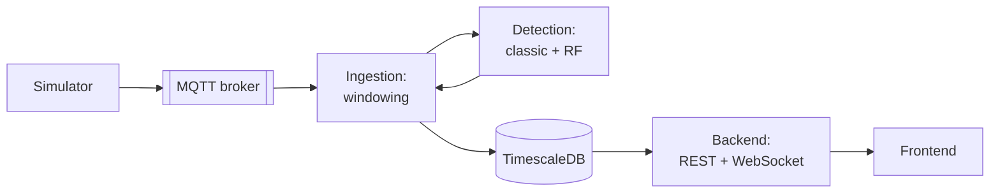

# From Offline Detection to a Distributed IoT Pipeline: Re-Engineering Control-Valve Stiction Detection for Production

**Maulana Iskak**

## Abstract

Control-valve stiction is responsible for an estimated 20–30% of oscillating control loops in process industries, degrading product quality and wasting energy [1]. Prior work by the author [2] applied a Random Forest (RF) classifier to stiction detection, trained on time-series features extracted from the International Stiction Data Base (ISDB) and validated on South African Council for Automatic Control (SACAC) data, achieving an F1 score of 87.5% and AUC of 0.979 on held-out validation loops. That work proved the modeling approach but stopped at a single-process, single-machine demonstration.

This paper re-engineers that result into a distributed, horizontally-scalable, multi-service IoT pipeline — five independently deployable services connected by MQTT, gRPC, and an optional Kafka-compatible scale-out path — and, in doing so, surfaces a finding the original offline evaluation could not: when the trained RF model is exercised against a live, streaming signal structurally different from its training distribution, its standard classification metrics collapse (AUC 0.079) even as a much simpler, training-free classic detector (ellipse-fit + Kano pattern analysis) scores perfectly (F1 = 1.000, AUC = 1.000) on the same 267-window streaming evaluation. We present the system design, the migration path from monolith to five independently-built-and-deployed services, and a quantified analysis of why an offline-validated model failed to generalize online — a result we argue is at least as valuable to document as the original model's offline performance.

**Keywords** — control valve, stiction, random forest, distributed systems, MQTT, gRPC, microservices, model generalization, train/serve skew

## 1. Introduction

### 1.1 Background

Oscillation in industrial control loops is a direct indicator of poor plant performance; Desborough's survey of 26,000 PID loops found only 16% performing well, with the remainder oscillating or operating open-loop [3]. Valve stiction — static friction in the valve stem exceeding dynamic friction, so that a disproportionately large input is required to move the stem at all — is one of the most common root causes [4]. When stiction occurs, controller output (OP) and process variable (PV) develop a characteristic nonlinear relationship (a stick phase, a slip-jump, then a moving phase), and this relationship repeats until the valve is serviced.

Non-invasive stiction detection methods (analyzing OP/PV time series rather than physically testing the valve) have moved from rule-based, offline analysis toward machine-learning-based, online detection as part of the broader Industry 4.0 shift toward real-time, automated fault detection [5]. The author's prior work [2] fits this trajectory: an RF classifier trained on tsfel-extracted time-series features, validated with a sliding-window online demonstration over MQTT.

### 1.2 Problem statement

The original implementation proved the *modeling* approach but was architecturally a single script: one process handled MQTT subscription, feature extraction, inference, and visualization together, with hardcoded paths and no separation between transport, business logic, and presentation. It could not scale beyond one machine, had no persistent store, and — critically for this paper — was never stress-tested against a live, continuously-streaming signal at a scale where classification metrics become statistically meaningful rather than anecdotal.

This paper addresses three questions the original work left open:

1. Can this detection approach be re-architected as a distributed system that meets standard production requirements — independent deployability, horizontal scalability, live observability — without changing the underlying detection logic?
2. Does a trained model's offline validation performance hold up when it is actually exercised as a live streaming service?
3. If it does not, what design choices make that failure survivable rather than catastrophic?

### 1.3 Contribution

We present: (1) a 5-service distributed architecture (simulator, ingestion, detection, backend, frontend), each independently built, tested, and deployed, connected via MQTT/gRPC/Kafka with no shared orchestrator repository; (2) a layered internal architecture (domain / usecase / repository / delivery) applied consistently across the Go and Python services; and (3) a quantified streaming evaluation across 267 live-streamed windows that exposes a train/serve distribution-shift failure in the RF model that no offline metric could have surfaced, alongside the system design decision (running a model-free classic detector unconditionally, in parallel) that keeps the system useful despite it.

## 2. System Design

### 2.1 Architecture overview

The pipeline follows a linear data-flow topology: a synthetic signal generator publishes over MQTT; an ingestion service performs sliding-window buffering per sensor and forwards completed windows to a detection service; the detection service scores each window with two independent methods and returns both results; the caller persists to a time-series store; a backend service exposes that store over REST and WebSocket; a frontend renders it live.

Full requirement traceability (functional and non-functional), the entity-relationship model, sequence diagrams for both the ingest and serve paths, and state diagrams for the windowing and activity-guard logic are maintained separately in `HLD.md` rather than duplicated here — this paper focuses on the architectural *reasoning*, not the complete specification.

### 2.2 From monolith to five services

The original single-script implementation was first rebuilt (V1) as three cooperating services in one repository — Go for MQTT ingestion and windowing, Python for detection (reusing the classic detector and, eventually, the trained RF model directly), TimescaleDB for storage, Grafana for visualization — then extended (V2) with a Kafka-compatible scale-out path so the detection tier can run as N stateless replicas in one consumer group, partitioned by sensor ID. A custom REST/WebSocket backend and React dashboard (V3) replaced Grafana as the primary interface, specifically so the classic detector and RF model's outputs could be shown side by side rather than picked between.

The single-repository structure was then split into five independent repositories — one per service — with no shared orchestrator: each repository builds, tests, and deploys entirely on its own, connected only by documented environment variables and, where a schema or API contract must be shared (the gRPC proto, the database schema), a deliberately duplicated copy in each consuming repository rather than a shared package. One early version of this split briefly introduced a coupling violation — the backend's Docker build cloned and built the frontend's source directly — which was caught by comparing the structure against a real production service and reverted; the frontend now ships as its own nginx-served image, reverse-proxying to the backend so the browser sees one origin while the two remain fully independent builds. This episode is documented in full, including the incorrect reasoning that produced it, because a negative architectural result is only useful if the mistake itself is visible.

### 2.3 Internal layering

Within each service, business logic is separated from I/O along four layers, applied consistently across both the Go services (ingestion, backend) and the Python service (detection): a **domain** layer of plain data types with no I/O; a **usecase** layer holding the actual logic (window buffering, the classic detector, the per-sensor activity guard); a **repository** layer for persistence; and a **delivery** layer of thin transport adapters (MQTT, gRPC, Kafka, REST, WebSocket) that translate between the wire format and domain types but contain no business logic themselves. This means, for example, that the detection service's classic-detector-plus-RF logic (`usecase.DetectionCore`) is identical whether it is invoked over gRPC or Kafka — the two delivery adapters are a few dozen lines of translation code each.

### 2.4 Why two detectors, not one

The system runs a training-free classic detector (ellipse-fit shape analysis plus a Kano stick-slip pattern check) unconditionally, alongside the trained RF model, and persists and displays both — never gating the classic result on the RF succeeding, or vice versa. This was a deliberate non-functional requirement (see `HLD.md` §2, NFR-1), motivated by the general risk that a data-driven model can fail silently under distribution shift while a rule-based method, having no training distribution to shift away from, cannot fail the same way. Section 4 shows this requirement was not a hypothetical hedge.

## 3. Methodology

### 3.1 Detection methods under test

**Classic detector.** Each window's PV and OP series are independently z-score normalized, then scored two ways: an ellipse-fit stiction index (the area/eccentricity of the PV-vs-OP scatter, since stiction opens a healthy near-diagonal trace into a loop) checked against a fixed threshold, and a Kano-style pattern check for the flat-then-jump stick-slip shape. A window is labeled `yes` only if both agree it is stiction, `no` only if both agree it is not, and `uncertain` otherwise. Neither check is fit to any training data.

**RF model.** The same architecture as the original work [2]: tsfel time-series features extracted from z-scored windows, feature-selected by correlation pruning, scored by a Random Forest trained on ISDB (train/test split) and validated on SACAC, with `predict_proba` thresholded at 0.5.

### 3.2 Streaming evaluation design

Six instances of the synthetic simulator (the same signal model used throughout this project: a scripted triangle-wave OP driving a stick-slip valve model, not a closed-loop controller — closed-loop PI control was tried first and rejected because it could self-oscillate from integral windup even with a perfectly healthy valve, confounding the exact signal this evaluation needs to be clean) were run concurrently: three with stiction injected, three without, each publishing at a genuine streaming rate (50 Hz) rather than a single batch. All six streamed through the full, independently-built pipeline — the same five repositories a production deployment would use — for several minutes, accumulating 267 completed windows before evaluation. Ground truth is the simulator's own configuration flag, not a third detector's opinion.

## 4. Results

### 4.1 Classification performance

| Metric | Classic detector | RF model |
|---|---|---|
| Accuracy | 100.0% | 50.9% |
| Precision | 100.0% | 50.9% |
| Recall | 100.0% | 100.0% |
| F1 | 1.000 | 0.675 |
| AUC | 1.000 | 0.079 |

The classic detector made zero misclassifications across all 267 windows and all 6 concurrently-streaming sensors. The RF model predicted "stiction" for every single window regardless of ground truth — its apparently reasonable F1 score is an artifact of always predicting the positive class against a roughly balanced evaluation set, not evidence of discrimination. AUC is the metric that exposes the actual failure: at 0.079, far below the 0.5 a random classifier would achieve, the model's own confidence score is *anti-correlated* with ground truth on this signal (mean `rf_probability` was numerically higher, on average, for the healthy sensors than the stiction ones).

### 4.2 Interpretation

This is not evidence the RF model is poorly built — the same model scored ROC-AUC 0.865 / PR-AUC 0.788 on real, held-out SACAC industrial data, comparable to the original work's reported metrics [2]. It is evidence of train/serve distribution shift: the model was trained on real industrial process recordings and is here being evaluated against a structurally different, synthetically-scripted signal it never saw during training. A tree ensemble handed inputs well outside its training distribution does not typically fail by abstaining or reporting low confidence — it fails by producing confident-looking numbers that do not track anything meaningful, which is exactly what the collapsed AUC shows.

### 4.3 Why the system survives this

Because §2.4's non-functional requirement was enforced structurally, not just as a monitoring afterthought, this failure did not take the system down or silently corrupt its output: the classic detector's independent, unconditional evaluation of every window continued to produce a correct answer, and the dashboard surfaces the disagreement between the two methods directly rather than resolving it. A design that had treated the RF model as the sole source of truth — a common pattern when a model has passed offline validation — would have shipped a system that appeared to work in every test that mattered before deployment and then silently misclassified every healthy sensor in production.

## 5. Discussion

The central lesson is not specific to Random Forests or to stiction detection: an offline validation split, however carefully constructed, is a measurement of the model against *its own data collection process*, not against whatever process will generate inputs after deployment. This project's evaluation set (ISDB/SACAC, real industrial recordings) and its serving-time input (a scripted synthetic signal, built for a different purpose — demonstrating the pipeline, not matching the model's training distribution) were never intended to match, which makes the failure here a deliberately extreme illustration rather than a subtle edge case. The same failure mode arises more quietly whenever a production input distribution drifts from a training set — sensor recalibration, a new process configuration, seasonal effects — and the AUC-based diagnosis used here (compare the ranking of predicted probabilities against ground truth, not just the thresholded accuracy) generalizes directly to detecting it.

A secondary lesson concerns system decomposition. Splitting a working monolith into independently deployable services is frequently justified in the abstract ("scalability," "team autonomy") without a concrete failure the decomposition prevents. In this project the concrete failure was observed directly during the split itself — the backend's build silently began depending on the frontend repository's availability and toolchain — and was only caught by deliberately comparing the result against an established production service's structure. That the mistake happened *while building toward* independent deployability, not despite it, is itself informative: decomposition is not self-enforcing, and needs to be checked against, rather than assumed from, having multiple repositories.

## 6. Conclusion

This paper took a prior offline, single-machine RF-based stiction detection result [2] and re-engineered it into a distributed, independently-deployable, horizontally-scalable IoT pipeline, then used the resulting system's ability to run realistic streaming load to ask a question the original offline evaluation structurally could not answer: does the trained model's performance survive contact with live, continuous data outside its training distribution? It does not — AUC collapses from 0.979 (offline, SACAC validation) to 0.079 (this streaming evaluation) — while a training-free classic detector run in parallel scores perfectly on the same data. The practical conclusion is architectural as much as it is statistical: a system that depends on a single learned model's offline metrics holding at serving time is fragile in a way that is invisible until it is exercised in production; running an independent, non-learned method alongside it, and surfacing disagreement rather than hiding it, converts a silent failure mode into a visible one.

### Future work

Retraining or fine-tuning the RF model against synthetic-signal data was deliberately not pursued, since evaluating a model against the same distribution it was tuned on would prove nothing about generalization; a more useful next step is expanding the training corpus with a wider variety of real industrial signal shapes and re-running this same streaming evaluation methodology against held-out synthetic and real signals to see whether the gap narrows. On the systems side, the Kafka-based horizontal-scaling path (§2.2) has been verified for partition assignment and throughput but not yet for consumer-group rebalancing under replica failure mid-stream, which remains open.

## Acknowledgments

The Random Forest stiction detection methodology, the ISDB/SACAC datasets, and the initial offline validation results this paper builds on are the author's prior undergraduate thesis work [2], conducted under the guidance of Dr.-Ing. Awang N. I. Wardana and Nopriadi, Ph.D., Department of Nuclear Engineering and Engineering Physics, Universitas Gadjah Mada.

## References

[1] L. Desborough and R. Miller, "Increasing customer value of industrial control performance monitoring — Honeywell's experience," *AIChE Symposium Series*, 2002.

[2] M. Iskak, A. N. I. Wardana, and Nopriadi, "Application of the Random Forest Method for Stiction Detection in Control Valves," undergraduate thesis, Department of Nuclear Engineering and Engineering Physics, Universitas Gadjah Mada.

[3] M. A. A. S. Choudhury, S. L. Shah, and N. F. Thornhill, "Diagnosis of poor control-loop performance using higher-order statistics," *Automatica*, vol. 40, 2004.

[4] R. Srinivasan and R. Rengaswamy, "Approaches for efficient stiction compensation in process control valves," *Computers & Chemical Engineering*, vol. 32, 2008.

[5] Y. Lu, "Industry 4.0: A survey on technologies, applications and open research issues," *Journal of Industrial Information Integration*, vol. 6, 2017.

[6] This project's own design documentation: `HLD.md`, `V1_PLAN.md`–`V3_PLAN.md`, `E2E_TEST.md`, `STREAMING_EVALUATION.md` (this repository's `docs/`) and the per-service READMEs at [valve-stiction-simulator](https://github.com/maulanaiskak/valve-stiction-simulator), [valve-stiction-ingestion](https://github.com/maulanaiskak/valve-stiction-ingestion), [valve-stiction-detection](https://github.com/maulanaiskak/valve-stiction-detection), [valve-stiction-backend](https://github.com/maulanaiskak/valve-stiction-backend), [valve-stiction-frontend](https://github.com/maulanaiskak/valve-stiction-frontend), and [valve-stiction-ml](https://github.com/maulanaiskak/valve-stiction-ml).
